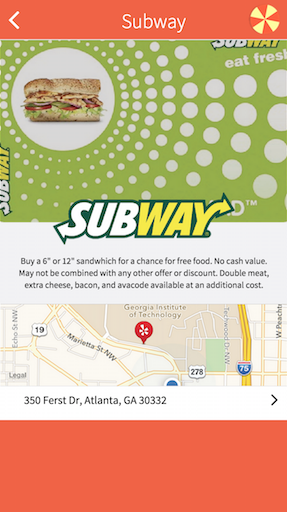

## Barcode Roulette
#### HTML / CSS Mockup. Non-working demo.
#### Atlanta Startup weekend project (Fall 2014)
A chance to get free stuff in many of your favorite stores! 

Barcode Roulette [BR] is a group-based digital punchcard that gives you a chance to be the one to win the freebie.

BR allows for many people to use the same barcode with one person winning the prize. Odds would be set and determined by restaurant. 

BR increases consumer stickiness by providing possibility to win each time it is used. The possibility of a discount drives the consumer to bring return business to the restaurant.

The app is an implementation of a [Skinner's Box](http://en.wikipedia.org/wiki/Operant_conditioning_chamber)

[Demo deck](Screenshots and demo deck/BarcodeRoulettePitchDeck1.pptx)

Example barcode page

